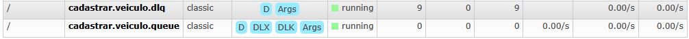

## POC - Mensageria

### Tecnologias:
- Java 17
- Sprint Boot 3.5.6
- Docker
- Postgres 15
- RabbitMQ

### Pré-requisitos
- Java
- Docker

### Instruções para execução

1. Executar o container do docker
```
docker compose up -d
```
2. Executar a aplicação
```
mvn spring-boot:run
```

### Endpoints
**/api/veiculos/batch**

Request: 
```
[
    {
        "placa": "ABC1D23",
        "modelo": "Onix",
        "categoria": "Automóvel, Caminhonete e Furgão"
    },
    ...
]
```

`Select * from veiculos` após o processamento da request:


### RabbitMQ Management UI
**Exchanges:**


**Queues:**

